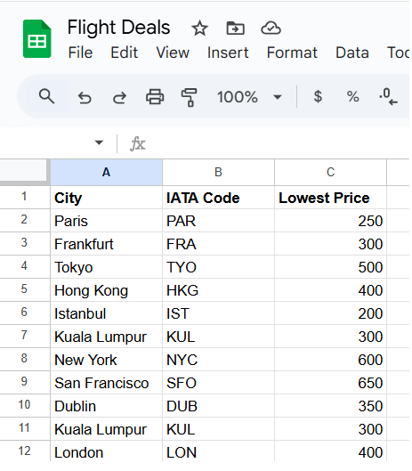
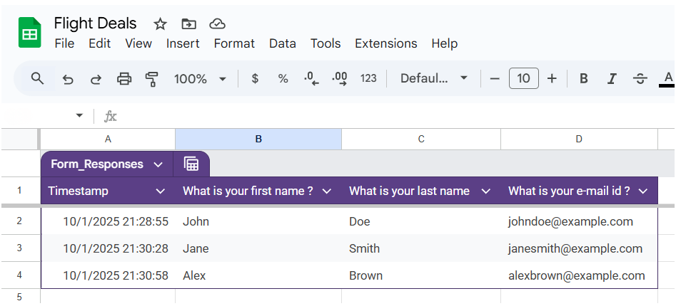

# Flight Deals Notifier

A Python automation project that searches for cheap flights using the **Amadeus API**, compares them with user-defined target prices in Google Sheets, and notifies subscribed users via **SMS** and **Email**.

---

## Features
- Fetches live flight offers from Amadeus API (direct and indirect flights).
- Users enter their desired cities and acceptable prices into a Google Sheet.
- Automatically inserts **IATA codes** for cities (first-time setup only).
- Compares live fares with target prices, and alerts users if a cheaper deal is found.
- Sends notifications through:
  - **SMS** via Twilio
  - **Email** via SMTP
- Supports multiple users from the Sheet.

---

## Tech Stack
- **Python 3.12+**
- **Amadeus API** (for flight data)
- **Sheety API** (for Google Sheets access)
- **Twilio** (SMS alerts)
- **SMTP** (email alerts)
- **dotenv** (for environment variables)

---

## Project Structure
flight-deals/
│
├── main.py # Main runner (production code)
├── setup_iata.py # One-time setup to populate IATA codes
├── data_manager.py # Handles Google Sheet read/write
├── flight_search.py # Handles Amadeus API auth and city lookups
├── flight_data.py # Retrieves flight offers and finds cheapest
├── notification_manager.py # SMS + Email notifications
├── .env # Environment variables (not committed)
└── README.md # Documentation

yaml
Copy code

---

## Setup

1. **Clone the repo**  
   ```bash
   git clone https://github.com/yourusername/flight-deals.git
   cd flight-deals
   
2. **Install dependencies**

```bash
pip install -r requirements.txt
```

3. **Google Sheet schema**

- **Prices sheet** must contain columns:
  - city (string) – destination city name
  - iataCode (string) – filled by setup script
  - lowestPrice (number) – acceptable price threshold
  - originCode (optional string) – if different origin per row
  - Sheety will add an id column automatically, you don’t need to create it.

Example (Prices sheet):  


---

- **Users sheet** must contain user details captured via Google Form.  
  - `First Name`  
  - `Last Name`  
  - `Email` (column name comes directly from your form, e.g. *What is your e-mail id?*)  
  -  If your column name differs, update the key in main.py where the email list is built.

Example (Users sheet):  


---

4. **Create .env file (in project root):**

```env
SHEETY_TOKEN=your_sheety_token
SHEETY_BASE=https://api.sheety.co/xxxxx/flightDeals
PRICES_ENDPOINT=${SHEETY_BASE}/prices
USERS_ENDPOINT=${SHEETY_BASE}/users

ACCOUNT_SID=your_twilio_sid
AUTH_TOKEN=your_twilio_auth_token

CLIENT_ID=your_amadeus_client_id
CLIENT_SECRET=your_amadeus_client_secret

MY_EMAIL=your_email@gmail.com
EMAIL_PASSWORD=your_app_password
SMTP_ADDR=smtp.gmail.com

ORIGIN_IATA=TRV

TWILIO_FROM=+1234567890
ALERT_PHONE=+19998887777
```


## First-time Setup – Add IATA Codes

- If your Google Sheet has only city names and not IATA codes, run the following once:

```bash
python setup_iata.py
```
- This will populate each row with the correct IATA code.
- Afterwards, just use main.py for daily execution.

## Running the Program

```bash
python main.py
```

- The script will fetch flight offers for each city.
- If a cheaper deal is found than the user’s target price, they will be alerted via SMS and email.
- By default, the origin airport is read from .env (ORIGIN_IATA).
- You can also override this per destination row using an originCode column in your sheet.
## Example Email/SMS Output

```
Low price alert! Only €305 to fly from TRV to CDG on 2025-10-01 with 1 stopover
```

## Contributing
- This is a showcase project. For enhancements, feel free to fork and improve.

## Notes

- Make sure to add .env to .gitignore to keep your credentials private.
- Email sending is tested with Gmail (requires app password, not your real Gmail password).
- Some providers may not support special currency symbols in emails. If you face encoding issues, fallback to plain USD, GBP, etc.

## License

- This project is licensed under the MIT License – see the [LICENSE](LICENSE) file for details.
